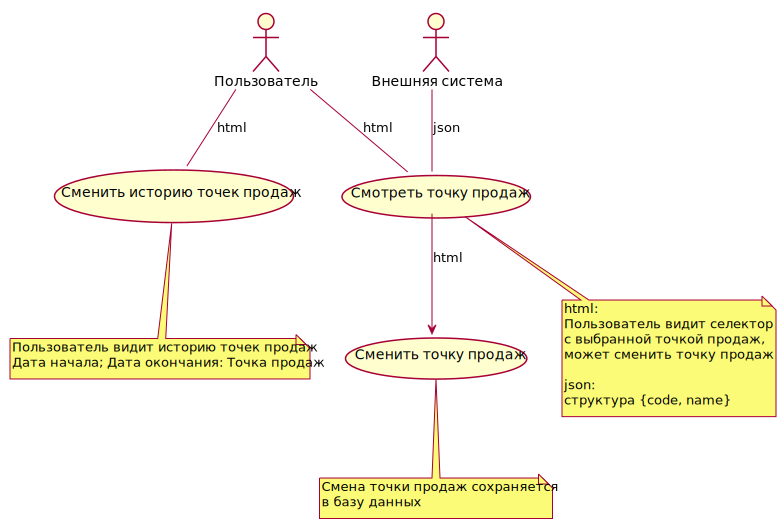
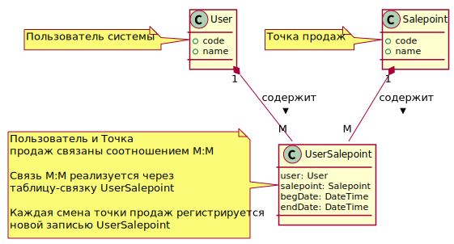
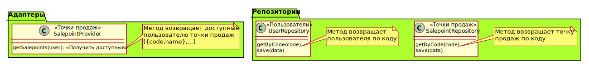

# Профиль пользователя

[Видео к спецификации](https://youtu.be/aPJCIcKAmCc)

## Требования к системе
Сервис "Профиль пользователя" предназначен для выбора и хранения точки продаж
пользователя.

1. Пользователь может просмотреть точку продаж 
1. Пользователь может сменить точку продаж
1. Пользователь просмотреть историю точек продаж, где он работал за промежуток времени
1. Внешняя система может получить текущую точку продаж пользователя

## Варианты использования системы

## Модель данных

## Сущности

